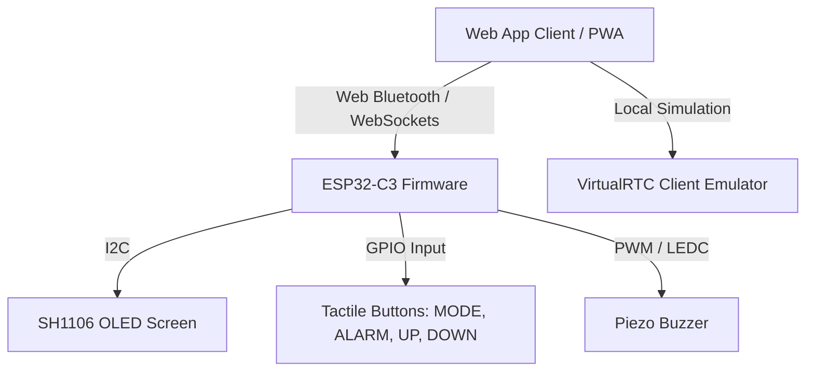

# RTC Alarm Clock V2 — Complete Build Specification

This specification document outlines the complete hardware, firmware, and software communication protocol of the ESP32-C3 RTC Alarm Clock V2. It is intended for developers who wish to rebuild, customize, or design an alternative user interface for this system without errors.

---

## 1. System Architecture

The project consists of three core layers:
1. **Physical Hardware**: An ESP32-C3 microcontroller connected to a 1.3" SH1106 OLED screen (I2C), a piezo buzzer driven by PWM (LEDC), and four momentary tactile input buttons.
2. **Firmware (ESP32-C3)**: Main hardware loop, state machine, and communication brokers. Exposes a **Web Bluetooth (BLE)** server and a local **Wi-Fi Access Point (AP)** hosting a **WebSocket server** (handling real-time JSON telemetry & plain-text commands).
3. **Web Application Client (PWA)**: A modular browser client built with Vanilla HTML5, Tailwind CSS, Lucide icons, AOS animations, and JS modules. Communicates bidirectionally via Web Bluetooth or WebSockets, and features an offline emulator (`VirtualRTC`) to simulate device states.



---

## 2. Hardware Specification & Wiring

### Microcontroller Settings (Arduino IDE)
*   **Board**: `ESP32C3 Dev Module`
*   **Upload Speed**: `921600`
*   **USB CDC On Boot**: `Enabled` (Required for USB serial debugging)
*   **Flash Size**: `4MB`
*   **Partition Scheme**: `Default 4MB with spiffs`

### Pinout Mapping
All tactile buttons must be wired directly to GND. The firmware configures internal pull-ups (`INPUT_PULLUP`), making them active-low.

| ESP32-C3 GPIO Pin | Connection | Function / Description |
| :--- | :--- | :--- |
| **GPIO 8** | I2C SDA | Data line for the SH1106 OLED display |
| **GPIO 9** | I2C SCL | Clock line for the SH1106 OLED display |
| **GPIO 3** | PWM Out | Piezo Buzzer Pin (uses ESP32 LEDC API) |
| **GPIO 4** | Tactile Input | **ALARM Button** (dismiss alarm / cycle editing fields) |
| **GPIO 5** | Tactile Input | **UP Button** (increase value / start / resume) |
| **GPIO 6** | Tactile Input | **DOWN Button** (decrease value / pause / snooze) |
| **GPIO 7** | Tactile Input | **MODE Button** (short press: cycle modes / long press: clock-set) |

---

## 3. Communication Protocols & Commands

The client interfaces with the firmware by sending plain-text UTF-8 command strings over either Web Bluetooth (character write) or WebSockets. The firmware matches these command strings exactly (trimming any trailing newlines).

### Outgoing Command Set (Web App → Hardware)

| Action / Feature | Command Format | Example |
| :--- | :--- | :--- |
| **Virtual Button Presses** | `BTN:<BUTTON>` | `BTN:UP`<br>`BTN:DOWN`<br>`BTN:ALARM`<br>`BTN:MODE_SHORT`<br>`BTN:MODE_LONG`<br>`BTN:LAP`<br>`BTN:SNOOZE` |
| **Jump to Mode** | `MODE:<0-3>` | `MODE:0` (0=Clock, 1=Stopwatch, 2=Alarm, 3=Timer) |
| **RTC Synchronization** | `SYNC:<epoch>,<tz>` | `SYNC:1753000000,-5` (Sync to Unix time + UTC-5 timezone) |
| **Write/Update Alarm** | `SET_ALARM:<slot>,<hr>,<min>,<en>,<days>` | `SET_ALARM:0,7,30,1,31` (Set slot 0, 07:30 AM, enabled, Mon-Fri [31]) |
| **Toggle Alarm Enable** | `ALARM_EN:<slot>,<0/1>` | `ALARM_EN:2,1` (Enable alarm slot 2) |
| **Snooze Active Alarm** | `SNOOZE:<slot>` | `SNOOZE:0` (Snooze active ringing alarm on slot 0 for 5 minutes) |
| **Dismiss Active Alarm** | `DISMISS_ALARM:<slot>` | `DISMISS_ALARM:0` (Turn off active ringing alarm on slot 0) |
| **Initialize Timer** | `SET_TIMER:<hr>,<min>,<sec>` | `SET_TIMER:0,10,30` (Set timer to 10 min 30 sec) |
| **Reset Active Timer** | `RESET_TIMER` | `RESET_TIMER` (Resets the countdown timer) |
| **Set Buzzer Volume** | `SET_VOLUME:<0-255>` | `SET_VOLUME:180` (Volume level 180 out of 255. Persists to flash) |
| **Buzzer Tone Test** | `BUZZ_TEST:<pattern>` | `BUZZ_TEST:1` (Plays pattern 1=Alarm, 2=Timer, 3=Snooze, 0=Stop) |

> [!NOTE]
> For `SET_ALARM` repeat days: It is an 8-bit bitmask where `bit 0 = Sunday`, `bit 1 = Monday`, ..., `bit 6 = Saturday`.
> *   `0x7F` (`127`): Everyday
> *   `0x1F` (`31`): Weekdays (Mon-Fri)
> *   `0x00` (`0`): One-shot (runs once, then disables)

---

## 4. Telemetry State Payloads

The firmware broadcasts its entire state machine automatically every **250 ms**.

### A. Web Bluetooth Telemetry (Binary, 34 Bytes)
Broadcasting occurs via notifications on the telemetry characteristic. Data should be parsed using a standard JavaScript `DataView` with big-endian mapping.

*   **Service UUID**: `4fafc201-1fb5-459e-8fcc-c5c9c331914b`
*   **Characteristic UUID**: `beb5483e-36e1-4688-b7f5-ea07361b26a8`

| Byte Offset | Data Type | Field | Description / Logic |
| :--- | :--- | :--- | :--- |
| **0** | `uint8` | `protocol` | Must be `2` for V2 protocol structure |
| **1 - 4** | `uint32` (BE) | `epoch` | Active Unix Timestamp of the RTC |
| **5** | `uint8` | `mode` | 0=Clock, 1=Stopwatch, 2=Alarm, 3=Timer |
| **6** | `uint8` | `flags` | Bitmask:<br>`Bit 0 (0x01)`: `alarmRinging`<br>`Bit 1 (0x02)`: `is12hFormat`<br>`Bit 2 (0x04)`: `settingMode` (Clock edit mode)<br>`Bit 3 (0x08)`: `bleConn` status<br>`Bit 4 (0x10)`: `wsConn` status |
| **7** | `uint8` | `tmrState` | 0=Stopped, 1=Running, 2=Paused, 3=Ringing |
| **8 - 11** | `uint32` (BE) | `swElapsedMs` | Elapsed milliseconds in stopwatch mode |
| **12 - 15** | `uint32` (BE) | `tmrRemainingMs`| Remaining milliseconds in countdown timer mode |
| **16** | `uint8` | `tmrInitMin` | Initial timer duration (minutes field) |
| **17** | `uint8` | `tmrInitSec` | Initial timer duration (seconds field) |
| **18** | `uint8` | `tmrSetField` | Active timer edit field: 0=View, 1=Hour, 2=Min, 3=Sec |
| **19** | `int8` | `tzOffset` | Active UTC offset in hours (-12 to +14) |
| **20** | `uint8` | `settingPos` | Active clock edit field position (0=Hour, 1=Min, 2=Sec, 3=Tz) |
| **21** | `uint8` | `swState` | 0=Stopped, 1=Running, 2=Paused |
| **22** | `uint8` | `ringingSlot` | Index of the active ringing alarm (0xFF / 255 = None) |
| **23** | `uint8` | `lapCount` | Number of recorded stopwatch lap times (0 to 8) |
| **24** | `uint8` | `alarmViewSlot`| Active alarm index currently highlighted on OLED (0 to 7) |
| **25** | `uint8` | `alarmEditField`| Active alarm edit field: 0=View, 1=Hour, 2=Min, 3=Enabled |
| **26** | `uint8` | `buzzerVolume` | Persistent volume level of the physical clock (0 to 255) |
| **27 - 33** | — | `reserved` | Padding / reserved bytes (value: 0) |

> [!TIP]
> In addition to the primary telemetry characteristic, V2 includes:
> *   **Alarm List Characteristic (`cba1d466-344c-4be3-ab3f-189f80dd7518`)**: Read-only binary array of all 8 alarms (32 bytes total; each alarm is 4 bytes: `[0]=Hour`, `[1]=Min`, `[2]=Flags (bit0=en, bit1=sn)`, `[3]=RepeatDays bitmask`).
> *   **Lap Characteristic (`d1a7c123-4561-47ab-a9bc-9a7e6a1bcdef`)**: Read-only binary array of up to 8 lap times (32 bytes total; each lap is a 4-byte `uint32` BE elapsed time).

### B. WebSocket Telemetry (JSON Payload)
Broadcasting occurs over a TEXT frame to all clients connected to `ws://192.168.4.1:81`.

```json
{
  "v": 2,
  "epoch": 1753000000,
  "mode": 0,
  "ringing": false,
  "ringSlot": -1,
  "12h": false,
  "setting": false,
  "tz": 0,
  "settingPos": 0,
  "sw": 0,
  "swMs": 0,
  "tmr": 0,
  "tmrMs": 300000,
  "tmrMin": 5,
  "tmrSec": 0,
  "tmrField": 0,
  "lapCount": 0,
  "laps": [3240, 7810],
  "alarms": [
    {"h":7, "m":30, "en":true, "sn":false, "rep":127},
    {"h":9, "m":0, "en":false, "sn":false, "rep":31},
    {"h":0, "m":0, "en":false, "sn":false, "rep":0},
    {"h":0, "m":0, "en":false, "sn":false, "rep":0},
    {"h":0, "m":0, "en":false, "sn":false, "rep":0},
    {"h":0, "m":0, "en":false, "sn":false, "rep":0},
    {"h":0, "m":0, "en":false, "sn":false, "rep":0},
    {"h":0, "m":0, "en":false, "sn":false, "rep":0}
  ],
  "alarmSlot": 0,
  "alarmField": 0,
  "volume": 180
}
```

---

## 5. Web Client Controller Guidelines

If you design a fresh, custom UI for this controller, follow these architectural constraints to ensure stability and zero desynchronization bugs.

### A. Strict Remote Control Model
The web application is a **remote display controller, not a state simulator**. 
*   **Action Rule**: Interacting with UI controls (like clicking a button or changing a setting) must only fire commands (`sendCmd()`). 
*   **Render Rule**: You must never manually increment counters, change timer clocks, or switch active tabs inside the UI button listeners. The display screen must only update when a new telemetry packet (BLE notification or WebSocket message) arrives containing the new state. This guarantees what you see on screen matches the physical microcontroller exactly.

### B. Optimistic UI Updates for Toggles
For immediate tactile responsiveness, toggle switches (e.g., enabling/disabling alarms) should bypass the remote display rule optimistically:
1. When a toggle is clicked, execute `sendCmd(ALARM_EN:...)`.
2. Immediately mutate the local model (`lastBleState.alarms[slot].en = isChecked`) in-memory.
3. Call your UI draw/render logic right away to show the updated switch state instantly.
4. When the next telemetry notification arrives (typically 250ms later), it will naturally overwrite and align with the state.

### C. Offline / Demo Mode Simulator (`VirtualRTC.js`)
To support offline users or PWAs launched without an active hardware connection:
1. Provide a fallback class (`VirtualRTC`) that implements the state telemetry schema.
2. Intercept `sendCmd()` when offline. Route it directly to a local method (`virtualRTC.handleCommand(cmd)`) which mutates a local state object.
3. Hook your primary UI `updateState()` callback to a continuous `requestAnimationFrame` tick loop updating from the `virtualRTC.tick()` state.

### D. Ringing Alarm Banner & Time Overlay
When `state.alarmRinging` becomes `true`:
*   Display a persistent, fixed overlay banner (`position: fixed; z-index: 100`) near the bottom of the viewport so that it overrides all views.
*   The banner must contain options to **Snooze (5m)** (sends `SNOOZE:<ringingSlot>`) and **Dismiss** (sends `DISMISS_ALARM:<ringingSlot>`).
*   Extract the alarm details from `state.alarms[state.ringingSlot]` and inject the ringing time directly into the banner text so the user knows which alarm is firing.

---

## 6. Build and Verification Checklist

When constructing a new implementation, verify you have fulfilled the checklist below:

*   [ ] **Compile Check**: Ensure ESP32 Arduino core library `Preferences.h` is configured to persist volume changes (`SET_VOLUME`) and alarm slots to non-volatile flash storage.
*   [ ] **PWM configuration**: Check that tone patterns are generated using the ESP32 `ledcAttach` API, supporting core-agnostic attachment for compatibility with Arduino ESP32 Core 3.x.
*   [ ] **Connection Fallbacks**: Verify PWA service workers (`sw.js`) and asset manifests compile correctly to serve the UI offline.
*   [ ] **Timezone Bounds**: Verify signed values for `tzOffset` handle negative boundary values correctly when converting raw bits into local clock offsets.
*   [ ] **Optimistic Syncing**: Verify toggling alarms off/on offline updates the local state array immediately, and that online toggles sync cleanly.
